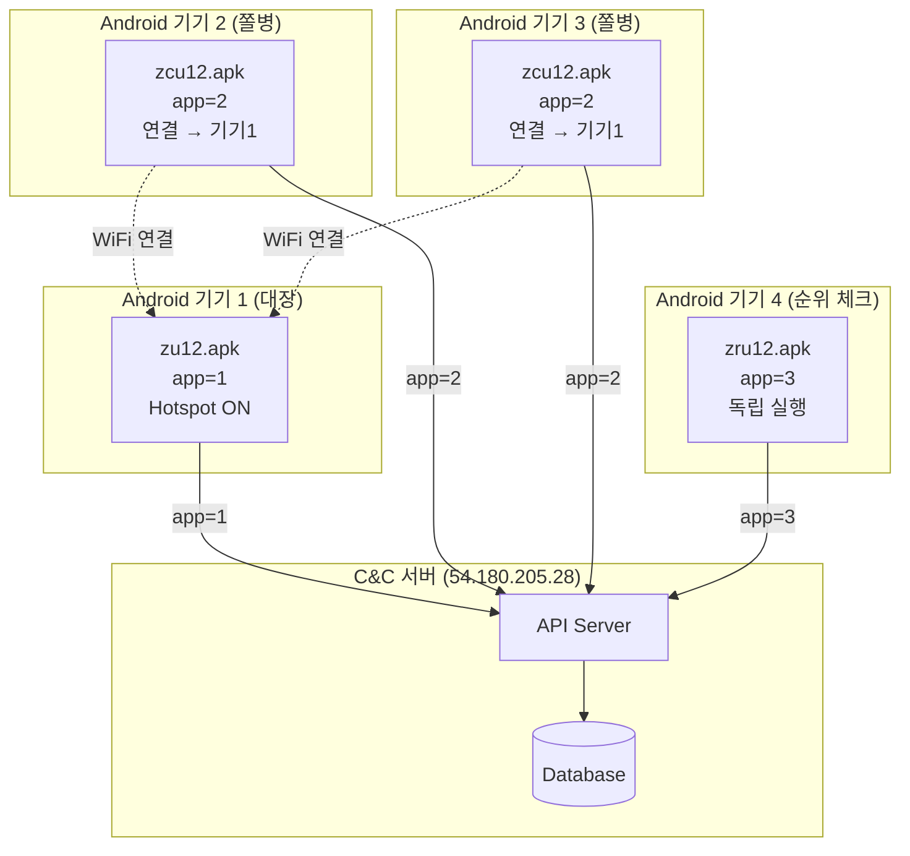
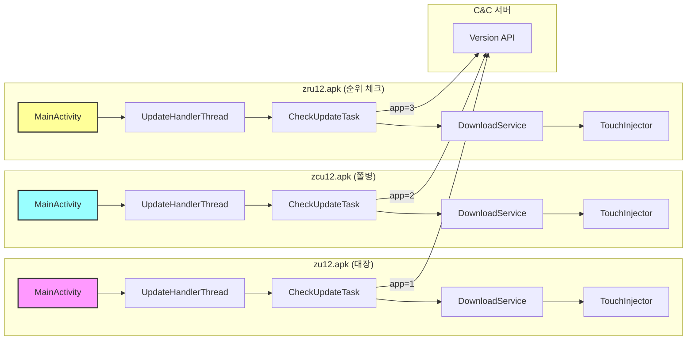
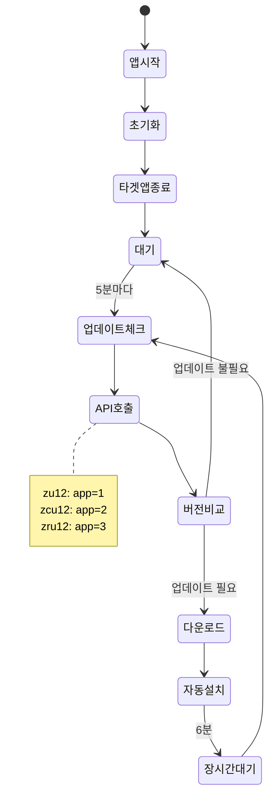

# 3개 APK 비교 분석 보고서

## 📋 목차
1. [개요](#개요)
2. [기본 정보 비교](#기본-정보-비교)
3. [아키텍처 비교](#아키텍처-비교)
4. [차이점 분석](#차이점-분석)
5. [공통점 분석](#공통점-분석)
6. [역할 및 용도](#역할-및-용도)
7. [UML 다이어그램](#uml-다이어그램)

---

## 🔍 개요

3개 APK (zu12, zcu12, zru12)는 **동일한 코드베이스**에서 **Build Flavor**만 다르게 빌드된 변형(Variant)입니다.

**핵심 차이점**:
- **패키지명**: zu12/zcu12는 동일, zru12만 다름
- **Flavor**: parent, child, rank
- **API 파라미터**: app=1, app=2, app=3

---

## 📊 기본 정보 비교

| 항목 | zu12.apk | zcu12.apk | zru12.apk |
|------|----------|-----------|-----------|
| **패키지명** | `com.zero.updater.zero` | `com.zero.updater.zero` | `com.zero.updater.rank` |
| **앱 이름** | 제로 Updater | 제로 Updater | 제로순위 Updater |
| **버전 코드** | 12 | 12 | 12 |
| **버전 이름** | 2.3 | 2.3c | 2.3r |
| **Flavor** | `parent` | `child` | `rank` |
| **역할** | 🎖️ 대장 봇 | 🪖 쫄병 봇 | 📊 순위 체크 봇 |
| **API 파라미터** | `app=1` | `app=2` | `app=3` |
| **타겟 앱** | Samsung Internet | Samsung Internet | Samsung Internet |

---

## 🏗️ 아키텍처 비교

### 1. 클래스 구조 (100% 동일)

```
com.loveplusplus.update/
├── ApkUtils.java
├── AppUtils.java
├── CheckUpdateTask.java
├── Constants.java
├── DownloadService.java
├── HttpUtils.java
├── NotificationHelper.java
├── StorageUtils.java
├── TouchInjector.java
├── UpdateApkFileProvider.java
├── UpdateChecker.java
├── UpdateDialog.java
├── engine/
│   └── SuCommander.java
└── sample/
    ├── MainActivity.java
    ├── UpdateHandlerThread.java
    ├── BootReceiver.java
    └── pattern/
        └── PatternHandlerThread.java
```

**결론**: 3개 APK 모두 **동일한 클래스 구조**를 가지고 있습니다.

---

### 2. 코드 비교

#### MainActivity.java

| 라인 | zu12 | zcu12 | zru12 |
|------|------|-------|-------|
| 23 | `com.zero.updater.zero.R.layout.activity_main` | `com.zero.updater.zero.R.layout.activity_main` | `com.zero.updater.rank.R.layout.activity_main` |
| 25 | `com.zero.updater.zero.R.string.title` | `com.zero.updater.zero.R.string.title` | `com.zero.updater.rank.R.string.title` |
| 26 | `com.zero.updater.zero.R.id.textView_status` | `com.zero.updater.zero.R.id.textView_status` | `com.zero.updater.rank.R.id.textView_status` |

**차이점**: 리소스 패키지명만 다름 (로직은 100% 동일)

---

#### CheckUpdateTask.java

| 라인 | zu12 | zcu12 | zru12 |
|------|------|-------|-------|
| 21 | `app=1&version_code=` | `app=2&version_code=` | `app=3&version_code=` |

**차이점**: API 파라미터만 다름 (로직은 100% 동일)

---

#### BuildConfig.java

| 필드 | zu12 | zcu12 | zru12 |
|------|------|-------|-------|
| **APPLICATION_ID** | `com.zero.updater.zero` | `com.zero.updater.zero` | `com.zero.updater.rank` |
| **FLAVOR** | `parent` | `child` | `rank` |
| **VERSION_NAME** | `2.3` | `2.3c` | `2.3r` |

**차이점**: 빌드 설정만 다름 (코드는 100% 동일)

---

## 🔍 차이점 분석

### 1. 패키지명

| APK | 패키지명 | 이유 |
|-----|---------|------|
| **zu12** | `com.zero.updater.zero` | 대장/쫄병 봇은 동일 패키지 |
| **zcu12** | `com.zero.updater.zero` | 대장/쫄병 봇은 동일 패키지 |
| **zru12** | `com.zero.updater.rank` | 순위 체크 봇은 별도 패키지 |

**이유**: zu12와 zcu12는 **동시에 설치 불가** (패키지명 동일), zru12는 **별도 설치 가능**

---

### 2. API 파라미터

| APK | API URL | 서버 응답 |
|-----|---------|----------|
| **zu12** | `http://54.180.205.28/zero/api/v1/mobile/version?app=1&version_code=524` | `{"version_code": 524, "url": "http://kimfinal77.ipdisk.co.kr/publist/HDD1/Updates/zero_524.apk"}` |
| **zcu12** | `http://54.180.205.28/zero/api/v1/mobile/version?app=2&version_code=524` | `{"version_code": 524, "url": "http://kimfinal77.ipdisk.co.kr/publist/HDD1/Updates/zero_child_524.apk"}` |
| **zru12** | `http://54.180.205.28/zero/api/v1/mobile/version?app=3&version_code=186` | `{"version_code": 186, "url": "http://kimfinal77.ipdisk.co.kr/publist/HDD1/Updates/zero_rank_186.apk"}` |

**결론**: 서버가 `app` 파라미터로 어떤 봇인지 구분하여 **다른 APK URL**을 반환합니다.

---

### 3. 버전 이름

| APK | 버전 이름 | 의미 |
|-----|----------|------|
| **zu12** | `2.3` | 기본 버전 |
| **zcu12** | `2.3c` | Child (쫄병) |
| **zru12** | `2.3r` | Rank (순위 체크) |

**결론**: 버전 이름으로 봇 유형을 구분할 수 있습니다.

---

## ✅ 공통점 분석

### 1. 100% 동일한 코드

| 항목 | 동일 여부 |
|------|----------|
| **MainActivity** | ✅ 100% 동일 (리소스 패키지명만 다름) |
| **UpdateHandlerThread** | ✅ 100% 동일 |
| **CheckUpdateTask** | ✅ 100% 동일 (API 파라미터만 다름) |
| **DownloadService** | ✅ 100% 동일 |
| **TouchInjector** | ✅ 100% 동일 |
| **SuCommander** | ✅ 100% 동일 |

**결론**: 3개 APK는 **동일한 코드베이스**에서 빌드되었습니다.

---

### 2. 동일한 동작 방식

| 동작 | zu12 | zcu12 | zru12 |
|------|------|-------|-------|
| **업데이트 체크 주기** | 5분 | 5분 | 5분 |
| **타겟 앱 강제 종료** | ✅ | ✅ | ✅ |
| **자동 설치 좌표** | (950, 1820) | (950, 1820) | (950, 1820) |
| **Root 권한 사용** | ✅ | ✅ | ✅ |
| **C&C 서버** | 54.180.205.28 | 54.180.205.28 | 54.180.205.28 |

**결론**: 3개 APK는 **동일한 방식으로 동작**합니다.

---

### 3. 동일한 타겟 앱

| APK | 타겟 앱 |
|-----|---------|
| **zu12** | `com.sec.android.app.sbrowser` (Samsung Internet) |
| **zcu12** | `com.sec.android.app.sbrowser` (Samsung Internet) |
| **zru12** | `com.sec.android.app.sbrowser` (Samsung Internet) |

**결론**: 3개 APK 모두 **Samsung Internet Browser**를 타겟으로 합니다.

---

## 🎯 역할 및 용도

### 1. zu12.apk (대장 봇, Leader)

#### 역할
- 🎖️ **대장 봇** (Parent)
- 핫스팟 제공 (추정)
- 트래픽 생성 리더

#### 특징
- **API 파라미터**: `app=1`
- **Flavor**: `parent`
- **패키지명**: `com.zero.updater.zero`

#### 사용 시나리오
```
1. 핫스팟 활성화 (IP 제공)
2. zcu12 봇들이 연결
3. 트래픽 생성 작업 수행
4. 5분마다 업데이트 체크
```

---

### 2. zcu12.apk (쫄병 봇, Follower)

#### 역할
- 🪖 **쫄병 봇** (Child)
- 핫스팟 연결 (추정)
- 트래픽 생성 팔로워

#### 특징
- **API 파라미터**: `app=2`
- **Flavor**: `child`
- **패키지명**: `com.zero.updater.zero` (zu12와 동일)

#### 사용 시나리오
```
1. zu12의 핫스팟에 연결
2. zu12의 IP 사용
3. 트래픽 생성 작업 수행
4. 5분마다 업데이트 체크
```

---

### 3. zru12.apk (순위 체크 봇, Rank Checker)

#### 역할
- 📊 **순위 체크 봇** (Rank)
- 네이버/쿠팡 순위 모니터링
- 순위 변동 보고

#### 특징
- **API 파라미터**: `app=3`
- **Flavor**: `rank`
- **패키지명**: `com.zero.updater.rank` (별도)

#### 사용 시나리오
```
1. 30분마다 순위 체크 (추정)
2. 네이버/쿠팡 검색 결과 확인
3. 순위 변동 서버에 보고
4. 5분마다 업데이트 체크
```

---

## 🔄 통합 워크플로우

### 1. 봇 네트워크 구성

```
┌─────────────────────────────────────────────────────────────┐
│                   봇 네트워크 (22개)                          │
│                                                              │
│  ┌──────────────────────────────────────────────────┐      │
│  │  트래픽 생성 봇 (18개, 6개 그룹)                  │      │
│  │                                                   │      │
│  │  그룹 1: zu12 (대장) + zcu12 × 2 (쫄병)           │      │
│  │  그룹 2: zu12 (대장) + zcu12 × 2 (쫄병)           │      │
│  │  그룹 3: zu12 (대장) + zcu12 × 2 (쫄병)           │      │
│  │  그룹 4: zu12 (대장) + zcu12 × 2 (쫄병)           │      │
│  │  그룹 5: zu12 (대장) + zcu12 × 2 (쫄병)           │      │
│  │  그룹 6: zu12 (대장) + zcu12 × 2 (쫄병)           │      │
│  └──────────────────────────────────────────────────┘      │
│                                                              │
│  ┌──────────────────────────────────────────────────┐      │
│  │  순위 체크 봇 (4개, 1개 그룹)                     │      │
│  │                                                   │      │
│  │  그룹 RC: zru12 × 4 (순위 체크)                   │      │
│  └──────────────────────────────────────────────────┘      │
│                                                              │
└─────────────────────────────────────────────────────────────┘
                            │
                            ▼
              ┌─────────────────────────────┐
              │  C&C 서버 (54.180.205.28)   │
              │  - app=1 → zu12 업데이트     │
              │  - app=2 → zcu12 업데이트    │
              │  - app=3 → zru12 업데이트    │
              └─────────────────────────────┘
```

---

### 2. 실행 흐름

```
1. C&C 서버: 캠페인 생성 (네이버 or 쿠팡)
   └─ 작업 할당 (JSON 패턴)

2. 트래픽 생성 봇 (zu12 + zcu12)
   ├─ zu12: 핫스팟 활성화
   ├─ zcu12: zu12 핫스팟 연결
   ├─ 검색 키워드 입력
   ├─ 상품 클릭
   ├─ 체류 시간 (30초~2분)
   └─ 뒤로가기

3. 순위 체크 봇 (zru12)
   ├─ 30분마다 순위 확인
   ├─ 네이버/쿠팡 검색 결과 파싱
   └─ 순위 변동 서버 보고

4. C&C 서버: 결과 분석
   └─ 순위 개선 여부 판단
```

---

## 📊 UML 다이어그램

### 1. 배포 다이어그램 (Deployment Diagram)



---

### 2. 컴포넌트 다이어그램 (Component Diagram)



---

### 3. 상태 다이어그램 (State Diagram) - 공통



---

## 🎓 핵심 요약

### 1. 3개 APK의 관계

| 항목 | 설명 |
|------|------|
| **코드베이스** | 100% 동일 |
| **빌드 방식** | Build Flavor로 구분 |
| **차이점** | 패키지명, API 파라미터, 버전 이름 |
| **공통점** | 로직, 클래스 구조, 동작 방식 |

---

### 2. 역할 구분

| APK | 역할 | API | 패키지명 |
|-----|------|-----|---------|
| **zu12** | 🎖️ 대장 봇 (핫스팟 제공) | `app=1` | `com.zero.updater.zero` |
| **zcu12** | 🪖 쫄병 봇 (핫스팟 연결) | `app=2` | `com.zero.updater.zero` |
| **zru12** | 📊 순위 체크 봇 | `app=3` | `com.zero.updater.rank` |

---

### 3. 서버 구분 방식

```
C&C 서버 (54.180.205.28)
├─ app=1 → zero_524.apk (zu12 업데이트)
├─ app=2 → zero_child_524.apk (zcu12 업데이트)
└─ app=3 → zero_rank_186.apk (zru12 업데이트)
```

---

### 4. 봇 네트워크 구성

```
트래픽 생성 봇 (18개)
├─ zu12 × 6 (대장)
└─ zcu12 × 12 (쫄병)

순위 체크 봇 (4개)
└─ zru12 × 4 (순위 체크)

총 22개 봇
```

---

## 🔍 특이사항

### 1. 패키지명 전략

- **zu12와 zcu12**: 동일 패키지명 (`com.zero.updater.zero`)
  - **이유**: 동일 기기에 동시 설치 불가 (역할 구분)
  - **효과**: zu12 또는 zcu12 중 하나만 설치 가능

- **zru12**: 별도 패키지명 (`com.zero.updater.rank`)
  - **이유**: zu12/zcu12와 동시 설치 가능
  - **효과**: 트래픽 생성 + 순위 체크 동시 실행 가능

---

### 2. API 파라미터 전략

- **서버가 `app` 파라미터로 봇 유형 구분**
- **각 봇에 맞는 APK URL 반환**
- **버전 관리 독립적** (zu12: v524, zru12: v186)

---

### 3. Build Flavor 활용

```gradle
// build.gradle (추정)
android {
    flavorDimensions "role"
    productFlavors {
        parent {
            dimension "role"
            applicationId "com.zero.updater.zero"
            versionNameSuffix ""
        }
        child {
            dimension "role"
            applicationId "com.zero.updater.zero"
            versionNameSuffix "c"
        }
        rank {
            dimension "role"
            applicationId "com.zero.updater.rank"
            versionNameSuffix "r"
        }
    }
}
```

---

**결론**: 3개 APK는 **동일한 코드베이스**에서 **Build Flavor**로 구분된 변형이며, **API 파라미터**로 서버가 역할을 구분합니다.
