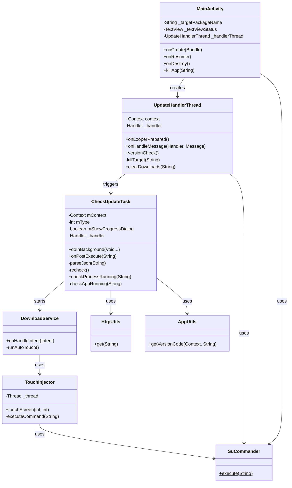
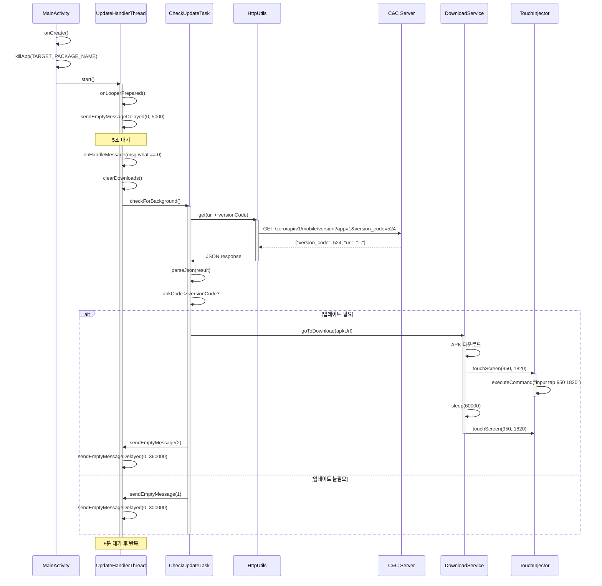
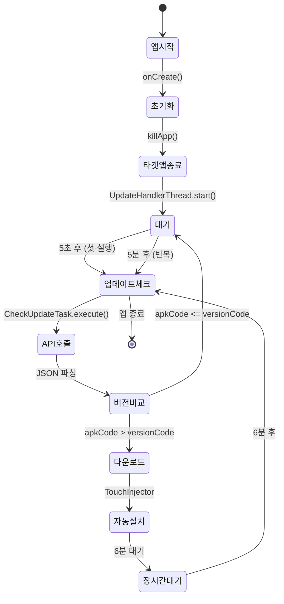

# zu12.apk 정밀 분석 보고서

## 📋 목차
1. [APK 기본 정보](#apk-기본-정보)
2. [전체 아키텍처](#전체-아키텍처)
3. [주요 모듈 및 클래스](#주요-모듈-및-클래스)
4. [API 호출 흐름](#api-호출-흐름)
5. [데이터 입출력 구조](#데이터-입출력-구조)
6. [보안 및 Root 제어](#보안-및-root-제어)
7. [UI 및 사용자 흐름](#ui-및-사용자-흐름)
8. [UML 다이어그램](#uml-다이어그램)

---

## 🔍 APK 기본 정보

### 1. 패키지 정보

| 항목 | 값 |
|------|-----|
| **패키지명** | `com.zero.updater.zero` |
| **앱 이름** | 제로 Updater |
| **버전 코드** | 12 |
| **버전 이름** | 2.3 |
| **Flavor** | `parent` (대장 봇) |
| **Build Type** | debug |
| **타겟 앱** | Samsung Internet Browser (`com.sec.android.app.sbrowser`) |

---

### 2. 권한 (Permissions)

```xml
<uses-permission android:name="android.permission.INTERNET" />
<uses-permission android:name="android.permission.WRITE_EXTERNAL_STORAGE" />
<uses-permission android:name="android.permission.READ_EXTERNAL_STORAGE" />
<uses-permission android:name="android.permission.REQUEST_INSTALL_PACKAGES" />
<uses-permission android:name="android.permission.ACCESS_NETWORK_STATE" />
```

---

### 3. 컴포넌트

#### Activities
- `MainActivity` - 메인 액티비티

#### Services
- `DownloadService` - APK 다운로드 및 자동 설치

#### Receivers
- `BootReceiver` - 부팅 시 자동 실행

---

## 🏗️ 전체 아키텍처

### 1. 시스템 아키텍처

```
┌─────────────────────────────────────────────────────────────┐
│                    zu12.apk (대장 봇)                        │
│                                                              │
│  ┌────────────────────────────────────────────────────┐    │
│  │           MainActivity (UI Layer)                   │    │
│  │  - 앱 버전 표시                                      │    │
│  │  - 타겟 앱 강제 종료                                 │    │
│  │  - UpdateHandlerThread 시작                         │    │
│  └────────────────┬───────────────────────────────────┘    │
│                   │                                          │
│  ┌────────────────▼───────────────────────────────────┐    │
│  │      UpdateHandlerThread (Core Logic)              │    │
│  │  - 5분마다 업데이트 체크                            │    │
│  │  - 타겟 앱 강제 종료                                │    │
│  │  - 캐시 정리                                        │    │
│  └────────────────┬───────────────────────────────────┘    │
│                   │                                          │
│  ┌────────────────▼───────────────────────────────────┐    │
│  │         CheckUpdateTask (Network Layer)            │    │
│  │  - API 호출: http://54.180.205.28/...              │    │
│  │  - JSON 파싱                                        │    │
│  │  - 버전 비교                                        │    │
│  └────────────────┬───────────────────────────────────┘    │
│                   │                                          │
│  ┌────────────────▼───────────────────────────────────┐    │
│  │         DownloadService (Download Layer)           │    │
│  │  - APK 다운로드                                     │    │
│  │  - 자동 설치 (TouchInjector)                       │    │
│  └────────────────┬───────────────────────────────────┘    │
│                   │                                          │
│  ┌────────────────▼───────────────────────────────────┐    │
│  │          TouchInjector (Root Layer)                │    │
│  │  - Root 권한으로 input tap 실행                    │    │
│  │  - 설치 버튼 자동 클릭 (950, 1820)                 │    │
│  └────────────────────────────────────────────────────┘    │
│                                                              │
└─────────────────────────────────────────────────────────────┘
                            │
                            ▼
              ┌─────────────────────────────┐
              │  C&C 서버 (54.180.205.28)   │
              │  - 버전 체크 API             │
              │  - APK 다운로드 URL 제공     │
              └─────────────────────────────┘
```

---

## 📦 주요 모듈 및 클래스

### 1. Core Classes

| 클래스 | 역할 | 주요 메서드 |
|--------|------|-----------|
| **MainActivity** | 메인 액티비티 | `onCreate()`, `killApp()` |
| **UpdateHandlerThread** | 업데이트 체크 루프 | `onHandleMessage()`, `versionCheck()`, `killTarget()` |
| **CheckUpdateTask** | 버전 체크 및 업데이트 | `doInBackground()`, `parseJson()`, `checkProcessRunning()` |
| **DownloadService** | APK 다운로드 및 설치 | `onHandleIntent()`, `runAutoTouch()` |
| **TouchInjector** | Root 터치 제어 | `touchScreen(int x, int y)`, `executeCommand()` |

---

### 2. Utility Classes

| 클래스 | 역할 |
|--------|------|
| **HttpUtils** | HTTP GET 요청 |
| **AppUtils** | 앱 버전 정보 조회 |
| **ApkUtils** | APK 파일 처리 |
| **StorageUtils** | 저장소 경로 관리 |
| **SuCommander** | Root 명령어 실행 |

---

### 3. Pattern Classes

| 클래스 | 역할 |
|--------|------|
| **PatternHandlerThread** | HandlerThread 패턴 구현 |
| **OnHandleMessageListener** | 메시지 핸들러 리스너 인터페이스 |

---

## 🔄 API 호출 흐름

### 1. 버전 체크 API

#### 엔드포인트

```
GET http://54.180.205.28/zero/api/v1/mobile/version?app=1&version_code={version}
```

**파라미터**:
- `app=1`: zu12 (대장 봇)
- `version_code`: 현재 설치된 타겟 앱 버전

---

#### 응답 (JSON)

```json
{
  "version_code": 524,
  "url": "http://kimfinal77.ipdisk.co.kr/publist/HDD1/Updates/zero_524.apk",
  "update_message": ""
}
```

---

### 2. API 호출 흐름도

```
┌─────────────────────────────────────────────────────────────┐
│  1. UpdateHandlerThread (5분마다)                            │
│     └─ sendEmptyMessageDelayed(0, 300000)                   │
└─────────────────┬───────────────────────────────────────────┘
                  │
                  ▼
┌─────────────────────────────────────────────────────────────┐
│  2. onHandleMessage(msg.what == 0)                          │
│     └─ UpdateChecker.checkForBackground()                   │
└─────────────────┬───────────────────────────────────────────┘
                  │
                  ▼
┌─────────────────────────────────────────────────────────────┐
│  3. CheckUpdateTask.execute()                               │
│     └─ doInBackground()                                     │
│        └─ HttpUtils.get(url + versionCode)                  │
└─────────────────┬───────────────────────────────────────────┘
                  │
                  ▼
┌─────────────────────────────────────────────────────────────┐
│  4. C&C 서버 (54.180.205.28)                                │
│     └─ 버전 체크 및 APK URL 반환                            │
└─────────────────┬───────────────────────────────────────────┘
                  │
                  ▼
┌─────────────────────────────────────────────────────────────┐
│  5. onPostExecute(result)                                   │
│     └─ parseJson(result)                                    │
│        ├─ 버전 비교 (apkCode > versionCode)                 │
│        └─ UpdateDialog.goToDownload(apkUrl)                 │
└─────────────────┬───────────────────────────────────────────┘
                  │
                  ▼
┌─────────────────────────────────────────────────────────────┐
│  6. DownloadService.startService()                          │
│     └─ APK 다운로드 및 자동 설치                            │
└─────────────────────────────────────────────────────────────┘
```

---

## 💾 데이터 입출력 구조

### 1. 네트워크 입출력

#### HTTP GET 요청

```java
// HttpUtils.java
public static String get(String url) {
    HttpURLConnection connection = null;
    try {
        URL requestUrl = new URL(url);
        connection = (HttpURLConnection) requestUrl.openConnection();
        connection.setRequestMethod("GET");
        connection.setConnectTimeout(10000);
        connection.setReadTimeout(10000);
        
        InputStream inputStream = connection.getInputStream();
        BufferedReader reader = new BufferedReader(new InputStreamReader(inputStream));
        StringBuilder response = new StringBuilder();
        String line;
        while ((line = reader.readLine()) != null) {
            response.append(line);
        }
        return response.toString();
    } catch (Exception e) {
        e.printStackTrace();
        return null;
    } finally {
        if (connection != null) {
            connection.disconnect();
        }
    }
}
```

---

### 2. 파일 입출력

#### APK 다운로드 경로

```
/data/data/com.zero.updater.zero/cache/{filename}.apk
```

#### 캐시 정리

```java
// UpdateHandlerThread.java
public void clearDownloads(String packageName) {
    String cmd = "rm -rf /data/data/" + packageName + "/cache/*.apk";
    SuCommander.execute(cmd);
}
```

---

### 3. SharedPreferences (없음)

zu12.apk는 SharedPreferences를 사용하지 않습니다.

---

### 4. 데이터베이스 (없음)

zu12.apk는 데이터베이스를 사용하지 않습니다.

---

## 🔐 보안 및 Root 제어

### 1. Root 권한 획득

```java
// SuCommander.java
public static void execute(String command) throws IOException, InterruptedException {
    Process process = Runtime.getRuntime().exec("su");
    DataOutputStream os = new DataOutputStream(process.getOutputStream());
    os.writeBytes(command + "\n");
    os.writeBytes("exit\n");
    os.flush();
    os.close();
    process.waitFor();
}
```

---

### 2. Root 명령어 사용 사례

#### A. 앱 강제 종료

```java
// MainActivity.java
public void killApp(String packageName) {
    String cmd = "/system/bin/am force-stop " + packageName;
    SuCommander.execute(cmd);
}
```

#### B. 프로세스 확인

```java
// CheckUpdateTask.java
public boolean checkProcessRunning(String packageName) {
    String command = "ps | grep " + packageName;
    Process process = Runtime.getRuntime().exec("su");
    DataOutputStream outputStream = new DataOutputStream(process.getOutputStream());
    outputStream.writeBytes(command + "\n");
    outputStream.writeBytes("exit\n");
    outputStream.flush();
    
    BufferedReader in = new BufferedReader(new InputStreamReader(process.getInputStream()));
    return in.readLine() != null;
}
```

#### C. 화면 터치 (자동 설치)

```java
// TouchInjector.java
public void touchScreen(int x, int y) {
    String xy = String.format("%s %s", x, y);
    String cmd = "input tap " + xy + "\n";
    executeCommand(cmd);
}

// DownloadService.java
private void runAutoTouch() {
    TouchInjector injector = new TouchInjector();
    
    SystemClock.sleep(10000);  // 10초 대기
    injector.touchScreen(950, 1820);  // 설치 버튼 클릭
    
    SystemClock.sleep(60000);  // 60초 대기
    injector.touchScreen(950, 1820);  // 실행 버튼 클릭
}
```

---

### 3. 보안 취약점

| 취약점 | 설명 | 위험도 |
|--------|------|--------|
| **하드코딩된 API URL** | `http://54.180.205.28/...` | 🔴 높음 |
| **HTTP 사용** | HTTPS 미사용 (중간자 공격 가능) | 🔴 높음 |
| **Root 권한 필수** | Root 탐지 시 차단 가능 | 🟡 중간 |
| **좌표 하드코딩** | UI 변경 시 작동 불가 | 🟡 중간 |

---

## 🖥️ UI 및 사용자 흐름

### 1. MainActivity UI

```
┌─────────────────────────────────────┐
│         제로 Updater                 │
├─────────────────────────────────────┤
│                                      │
│  Updater Version: v12                │
│  제로순위 Version: v524              │
│                                      │
│  (자동으로 업데이트 체크 중...)       │
│                                      │
└─────────────────────────────────────┘
```

---

### 2. 사용자 흐름

```
1. 앱 시작
   └─ MainActivity.onCreate()
      ├─ Samsung Internet Browser 강제 종료
      └─ UpdateHandlerThread 시작

2. 5초 후 첫 업데이트 체크
   └─ UpdateHandlerThread.onLooperPrepared()
      └─ sendEmptyMessageDelayed(0, 5000)

3. 업데이트 체크 (5분마다 반복)
   └─ onHandleMessage(msg.what == 0)
      ├─ clearDownloads() - 캐시 정리
      └─ UpdateChecker.checkForBackground()
         └─ CheckUpdateTask.execute()

4. 버전 비교
   └─ parseJson(result)
      ├─ apkCode > versionCode → 업데이트 필요
      └─ apkCode <= versionCode → 다음 체크 대기

5. 업데이트 다운로드 및 설치
   └─ UpdateDialog.goToDownload(apkUrl)
      └─ DownloadService.startService()
         ├─ APK 다운로드
         ├─ 자동 설치 (TouchInjector)
         └─ 완료 후 6분 대기

6. 타겟 앱 확인
   └─ checkProcessRunning(TARGET_PACKAGE_NAME)
      ├─ 실행 중 → 대기
      └─ 미실행 → 강제 실행
```

---

## 📊 UML 다이어그램

### 1. 클래스 다이어그램



---

### 2. 시퀀스 다이어그램 (업데이트 체크)



---

### 3. 상태 다이어그램



---

## 🎯 핵심 요약

### 1. 주요 모듈별 역할

| 모듈 | 역할 |
|------|------|
| **MainActivity** | UI 표시, 타겟 앱 강제 종료, UpdateHandlerThread 시작 |
| **UpdateHandlerThread** | 5분마다 업데이트 체크 루프, 타겟 앱 관리 |
| **CheckUpdateTask** | C&C 서버 API 호출, 버전 비교, 업데이트 트리거 |
| **DownloadService** | APK 다운로드 및 자동 설치 |
| **TouchInjector** | Root 권한으로 화면 터치 (설치 버튼 자동 클릭) |

---

### 2. 실행 시 API 호출 및 이벤트 흐름

```
1. 앱 시작 → 타겟 앱 강제 종료
2. 5초 후 첫 업데이트 체크
3. C&C 서버 API 호출 (app=1)
4. 버전 비교 → 업데이트 필요 시 다운로드
5. 자동 설치 (TouchInjector)
6. 5분마다 반복
```

---

### 3. 데이터 입출력 구조

| 구분 | 경로/방식 |
|------|----------|
| **네트워크** | HTTP GET (54.180.205.28) |
| **파일** | `/data/data/com.zero.updater.zero/cache/*.apk` |
| **데이터베이스** | 없음 |
| **SharedPreferences** | 없음 |

---

### 4. 보안/암호화 관련 처리 구간

| 구간 | 처리 |
|------|------|
| **Root 권한** | `su` 명령어 실행 (SuCommander) |
| **API 통신** | HTTP (암호화 없음) ⚠️ |
| **APK 다운로드** | HTTP (암호화 없음) ⚠️ |

---

### 5. UI 및 사용자 흐름 제어 로직

- **자동 실행**: 사용자 개입 없이 백그라운드에서 자동 실행
- **UI**: 버전 정보 표시만 (상호작용 없음)
- **타겟 앱 제어**: 강제 종료 → 업데이트 → 강제 실행

---

## 🔍 특이사항

### 1. Flavor: `parent` (대장 봇)

- **API 파라미터**: `app=1`
- **역할**: 대장 봇 (Leader)
- **차이점**: zcu12 (쫄병 봇, `app=2`)와 API 파라미터만 다름

---

### 2. 타겟 앱

- **패키지명**: `com.sec.android.app.sbrowser` (Samsung Internet Browser)
- **제어 방식**: Root 권한으로 강제 종료 및 실행

---

### 3. 자동 설치 좌표

- **좌표**: (950, 1820)
- **해상도**: 1080x2340 (FHD+) 기준
- **위치**: 화면 하단 중앙 (설치/실행 버튼)

---

**다음**: zcu12.apk 분석 →
